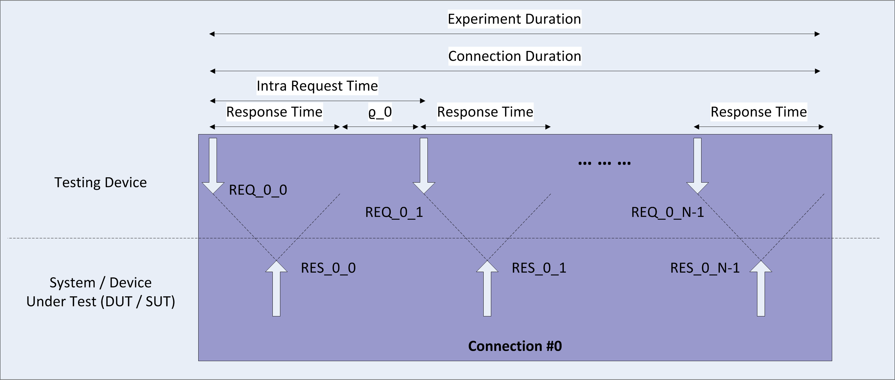
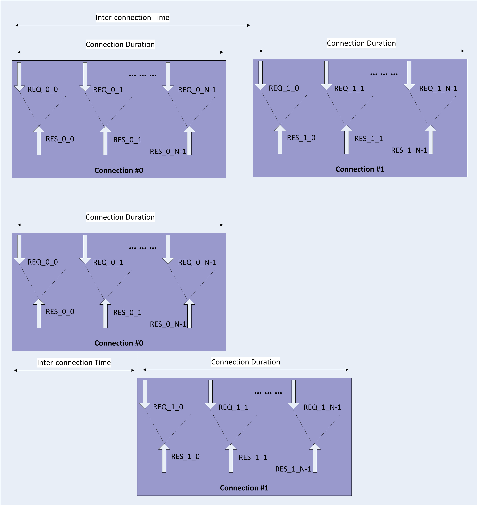

##### Catalogue (Marc, Fokus)
###### Description of Component
The Catalogue provides the service to store descriptors of Hyperties available for use. It also provides the means for the runtime to obtain (download) the implementation of a Hyperty and ProtocolStubs required for SigOFly after learning about a Hyperty from the Registry Service. [D4.1]

###### Metrics
As the Catalogue Service merely stores  information and in particular does not need to manipulate any of the stored records, [D4.1] identifies the following two non-functional requirements which yield to measureable key performance indicators (KPIs):
  * "The catalogue service shall allow discovering the information it stores."
  * "The catalogue service should provide fast response times. As querying the Catalogue occurs before an end-to-end communication is established, response times have no immediate impact on an established end-to-end communication."

As the Catalogue offers in general a purely request-based service, the KPIs *request (and response) rate* and *response time* are suitable indicators to assess those non-functional requirements.  In addition, the number of *errors* per experiment are recorded.

Note that populating the Catalogue with new entires--comparable to updating the contents of a web site or within an app store as compared to retirieving the content--is a relativly rare event which the initial tests do not assess seperately.

**Average Request and Response Rate**

Evaluating the (average) request and response rate allows to assess the behavor of the system under test (SUT) for increasing load.  For the conducted performance evaluation, three rates are captured:
  * demanded request rate
  * actual request rate
  * actual response rate

The *demanded request rate* reflects the rate at which the testing device is demanded (i.e., configured) to send requests to the SUT.  Hence, the *demanded request rate* imposes an upper bound on the request rate used in the test; naturally, the *actual request rate* which reflects the requests that are actually sent from the testing device to the SUT may be lower.  The reason may be two-fold: the SUT is saturating and hence, the possible *actual response rate* limits the rate at which (new) requests can be sent; or the testing device is reaching its capability, due to performance limits, to generate new requests.  Which of the two cases applies may be easily checked by increasing the number of testing devices that are configured to impose in parallel loads at which for one testing device the actual request and response rates derivate from the demanted request rate.

**Average Response Time**

The **average response time** allows to assess how fast a reThink device may retrieve a response from the catalogue.  This metric directly reflects the user experience as accessing Catalogue service might cause the application or hyperty accessing it to wait for the response.  In order to mitigte the effects of the network delay on the reported response time, reported results should mention the round-trip-time between SUT and the testing device as, e.g., measured via ping.

**Errors**

The number of erros is recorded for each experiment in order to verify that reported measurements are not biased by any irregularities in the SUT, the testing device, or the communication between the latter two.  Errors checked for by the used testing tools consider [httperf-man]:
  * The number of times a session, connection, or call failed due to a client timeout.
  * The number of times a TCP connection failed with a socket−level timeout (ETIMEDOUT).
  * The number of times a TCP connection attempt failed with a "connection refused by server" error (ECONNREFUSED).
  * The number of times a TCP connection failed due to a RESET from the server. 
  * The number of times the httperf process was out of file descriptors. Whenever this count is non−zero, the test results are meaningless because the client was overloaded.
  * The number of times the client was out of TCP port numbers (EADDRNOTAVAIL). This error should never occur. If it does, the results should be discarded.
  * The number of times the system’s file descriptor table is full. Again, this error should never occur. If it does, the results should be discarded.

For purely assessing the performance of the SUT, the numbers of errors should be zero for each test.

**Request load imposed on SUT**

In every experiment, each testing device imposes a load on the SUT by issuing http(s)-get-requests frequently.

###### Tests
**System under Test**

The system under test (SUT) comprises set-up of the catalogue as found in the reTHINK testbed deployment.  The goal of the performance assessment is not to obtain theoretically achievable performance numbers as could be achieved in a "clean room environment", i.e., connecting the testing devices immediately to a catalouge instance; but instead to assess the catalogue in an environment which will be faced by users during the upcoming hackathon event. Besides that this setup assures that a positive performance assessment indicates the catalogue's ability to provide sufficient performance for reTHINK-specific events and tests, the chosen setup is close to a real world deployment anticipated in operators' commercial networks.

Figure **XXX-01** visualizes the test setup.  It distinguishes between the SUT (i.e. the catalgue-specific set-up) and the testing devices (i.e., the machines running the test tools). 

**Figure XXX-01: System under test (SUT) for the Catalogue performance assessment**

The testing devices are unix-based computers running autobench [autobench] and httperf [httperf].  The number of testing devices varies per experiment.  The testing devices are connected via Ethernet towards the SUT via an internal network, i.e., the public Internet is not included in the communication path.

Regarding the catalogue, the SUT comprises of:
  * one catalogue-broker;
  * one catalouge-database that contains example catalogue objects used for testing; 
  * two apache proxies, one being responsible for providing reverse-proxing while accessing the catalogue, and the other being responsible for securly hosting any certificates required for https-based access to the catalouge; and
  * one firewall.

For a detailed description of each component and how to set them up, please refer to [D6.1].

**Experiment Blueprint**

The basic experiment which is used to impose load on the SUT consist of a "testing device" that runs httperf [httperf] to send http-requests to the Catalouge.  The following parameters of httperf as considered in the experiment influcence the load imposed on the SUT:
  * rate -- the rate at which (persistent) http connections are invoked;
  * number of connections -- the number of connections to invoke per experiment; and
  * number of calls -- the number of http requests send for each connection.
  * 
  
Figure **XXX-02** illustrates a single connection issues by httperf.  For that connection, httperf issues N calls, i.e., http-requests.  Calls are issued sequentially, i.e., httperf waits for the response corresponding to REQ_0_x before it issues the following request, i.e., REQ_0_x+1.  The time at the testing device between issuing a request and receiving the corresponding response is denoted as *Response Time*.  The figure accounts as well for a potential processing time between receiving a response (e.g.: RES_0_x) and issuing the following request (e.g.: REQ_0_x+1); this time is refered to *rho_0*.  Accordingly, the *Inter-Request Time* is given by *rho_0* + *Response Time*; and the *Call Duration* is given by *N* * *Inter-Request Time* where *N* refers to the number of calls (i.e., issued http-requests) per connection.  As the number of calls per connection is given as a parameter

For this example, the resulting (average) request and response rate should be equal, i.e.: *N* / *Call Duration*.

**Figure XXX-02: Illustration of a single httperf connection**

Figure **XXX-03** illustrates the situation for multiple connections issued by httperf per experiment.  The top part of Figure **XXX-03** shows the case in which the *Connection Duration* is shorter than the *Inter-Connection Time*, the latter being configured via the connection *rate* ( *Inter-Connection Time* = 1 / *rate*).  Assuming *M* refers to the number of connections per experiment (which can be configured upon invokation of httperf), and *M* beeing sufficiently large, the average request rate for the depicted experiment can be approximated by *N* / *Inter-Connection Time*  or alternatively by *N* * *M* / *Experiment Duration*.  (Note that in Figure **XXX-03**, *M* = 2.)

**Figure XXX-03: Illustration of a multiple httperf connections**

The bottom part of Fiugre **XXX-03** shows the case in which the *Response Time* is so long that the resulting *Connection Duration* is longer than the *Inter-Connection Time*, i.e., due to the configured *rate*, a new connection is started before the previous connection finishes.  Due to the overlapping connections, we see periods in which http-requests are issued simultaneously from several connections; the *experiment duration* as shorter as compared to the situation illusted in the upper part of the figure.  Hence, the average request (and response) rate reported for the experiment shown in the bottom part of Figure **XXX-03** is higher. 

In conclusion, for assing the performance of the Catalogue, one has to set the connection *rate* to a rather high number in order to enforce the parallization of conections which in turn steers the number of calls (i.e. requests) per second.  Therein, the request rate can be controlled via the number of connections *M*.

Besides, it should be noted that httperf is not run immediately but is invoced by autobench [autobench] which allows to run several httperf-based experiments in a row where each experiment is invoked with a different connection rate.

For all experiments, the Catalogue is provisioned with catalogue objects as contained in the default database available as part of the "rethink/default-database" docker image.  The catalogue objects contain a descriptor and associated code for the "HelloWorldObserver" hyperty.  This hyperty descriptor is used in the http-request queries for all experiments.

Also, all experiments are repeated **XXXX TIMES** in order to obtain confidence intervals for the reported results.

###### References
**Please decide if references are to be included per section or if these references need to be moved into a dedicated section when integrating the contributions**

[autobench]  Autobench GitHub Repository.  Available online: https://github.com/menavaur/Autobench; last accessed June 2016.

[D4.1] Management and Security features specifications, reTHINK Deliverable D4.1.  reTHINK consortium, September 2015.

[D6.1] Testbed specification, reTHINK Deliverable D6.1.  reTHINK consortium, April 2016.

[httperf]  Httperf GitHub Repository.  Available online: https://github.com/httperf/httperf; last accessed June 2016.

[httperf-man] Httperf Man Page.  Available online: http://www.labs.hpe.com/research/linux/httperf/httperf-man-0.9.ps; last accessed June 2016.

